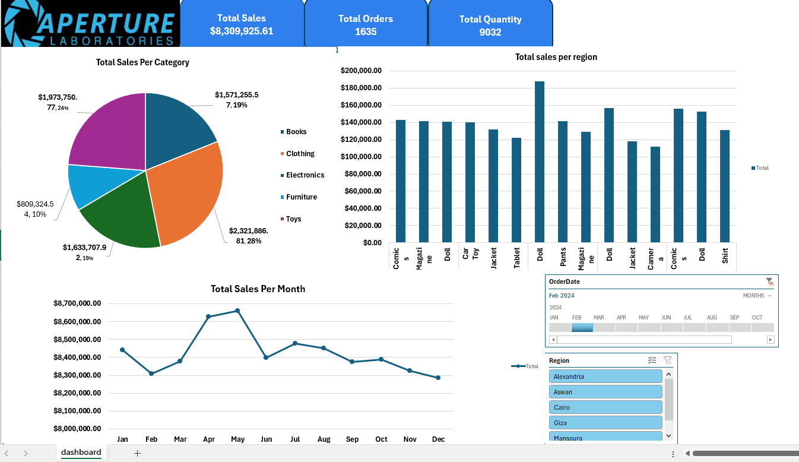

# Multi-Source Sales Data: Cleaning, Merging & Dashboard

End-to-end data analytics project: cleaning, merging, and visualizing a year of 
multi-source sales data using Python and Excel.

## Overview

This project started as 12 separate monthly order files, along with separate 
customer and product reference tables. The goal was to turn that into one clean, 
unified dataset and an interactive dashboard that surfaces sales performance by 
region, month, and category.

## Data Sources

- **Orders** — 12 monthly files, ~19,600 order records total
- **Customers** — customer ID, name, and region (300 customers)
- **Products** — product ID, name, category, and price

## What I Did

- Merged 12 separate monthly order files into a single dataset
- Standardized inconsistent raw date formats (ambiguous day/month ordering) 
  into one clean date field, and derived day-of-week
- Cleaned product pricing (removed currency symbols, fixed formatting issues)
- Found and corrected a data-quality issue in the Region field (stray internal 
  spaces causing duplicate region names, e.g. "Ma nsoura" vs "Mansoura")
- Removed duplicate and inconsistent text entries across products and customers
- Joined the cleaned Orders table with Customers and Products by ID
- Built an interactive Excel dashboard (PivotTables + Slicers) to explore the 
  results

## Dashboard

Three views into the cleaned data:
- **Total Sales per Region** — bar chart across 5 regions
- **Total Sales per Month** — trend line across the full year
- **Total Sales per Category** — category breakdown

## Tools Used

- **Python (Pandas)** — data cleaning, merging, and transformation
- **Excel** — PivotTables, Slicers, and dashboard layout

## Files in This Repository

| File | Description |
|---|---|
| `full_data_project.ipynb` | Full cleaning and merging workflow in Python |
| `df_Customers.csv` | Cleaned customer reference data |
| `df_products.csv` | Cleaned product reference data |
| `df_full_drp.csv` | Cleaned and merged order-level dataset |
| `cleaned_data.xlsx` | Final Excel workbook with the interactive dashboard |
| `sales_dashboard_chart.png` | Dashboard preview image |

## Key Results

- ~19,600 orders cleaned and unified from 12 separate monthly files
- Dashboard covering 5 regions, 5 product categories, and a full 12-month trend
